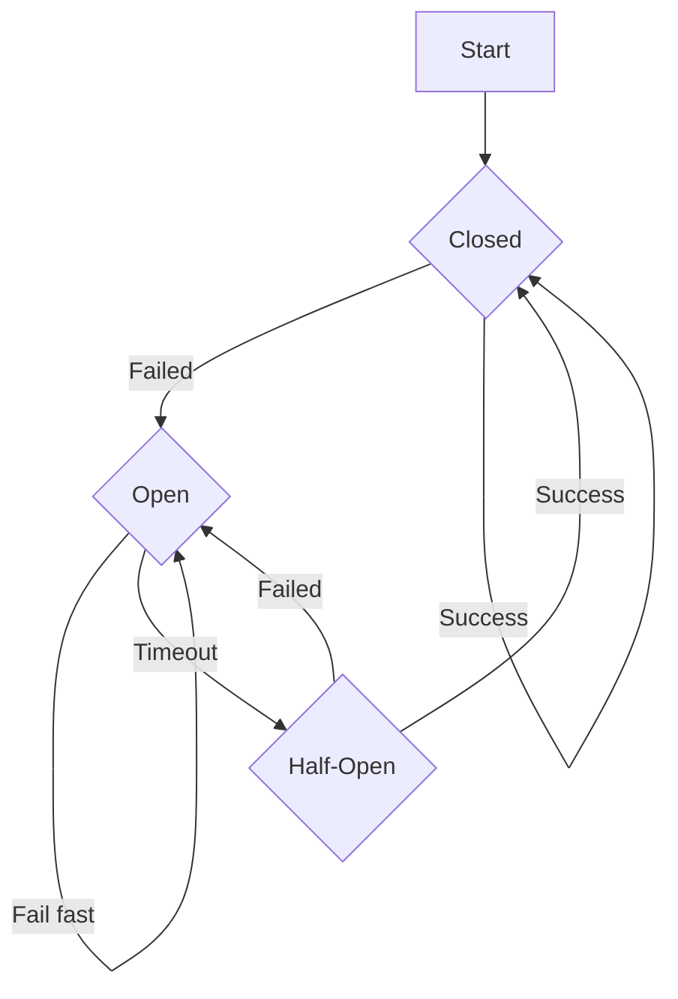

# Handling retries with pull replication 

Pull replication can be configured with one or more target instances requesting assets from a single source instance. This could result in an overloaded server and connection/request timeouts. There could also be network outage, hardware failures, server down for scheduled maintenance etc. that can lead to request failures. This document will outline the various failure scenarios and possible solutions.

A request failure could be transient in nature like a network glitch and a simple retry could continue the operation. In case of a server/hardware failure or a scheduled maintenance, it could result in a longer outage where the source cannot fulfill the requests for an unspecified amount of time.

## Pull replication Task

Pull replication task works in two steps.

The target instance first initiates a snapshot request to get a batch of asset identifiers.
Upon receiving the snapshot, the target then attempts to fetch each asset from the source instance.

A request failure could occur in any of these steps and should be handled accordingly.

## Handling failures

The Repository manager can use one of the following options to handle failures.
* `Connection/Request Timeout:` Timeouts are critical to avoid long/unlimited waiting times and helps in managing resources and keep network traffic under control. nxrm will use connection and request timeouts to ensure that network traffic is not too high to adversly impact the the source instance.
* `Retry:` retry is a common pattern to achieve a higher chance of success. It works best for transient failures but there is a risk of increased server load with a simple retry mechanism if multiple targets are attempting to retry requests on the same source instance. In case the server is already under heavy load, retrying can make the issue even worse. To overcome these issues, retry can be supported by exponential backoff and/or a circuit breaker.
* `Retry with exponential backoff:` Exponential backoff solves the problem with simple retries by changing the wait time from a constant to an exponential function. Still the number of retries or the exponential function should be capped to a maximum value.
* `Circuit Breaker:` Circuit breaker pattern can be used to handle the long lasting failures. It is used in conjuction with the retry pattern to fail-fast in case of persistent failure and save resources by avoiding unnecessary network requests or retries. The circuit breaker is initially in the CLOSED state. After a number of failed retry attempts, the circuit moves to OPEN state which means any subsequent requests should immediately fail. After a specific timeout period, the cicruit moves to HALF-OPEN state. This enables a probe call to go through in order to determine if the service is now available. In case of success the circuit moves back to CLOSED state. This flow is described in the following diagram.

## Potential failure scenarios in pull replication
* Source instance down
* Source not reachable
* Source internal error (503)
* Network outage (timeout)
* Source repo is blocked
* Asset not found (404) (asset was deleted)

Q: Is pull replication idempotent?

